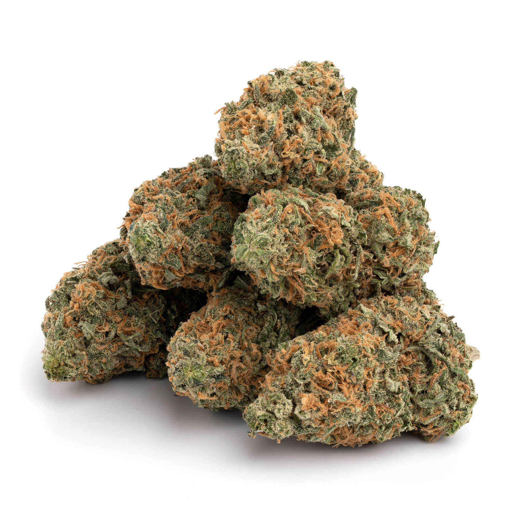
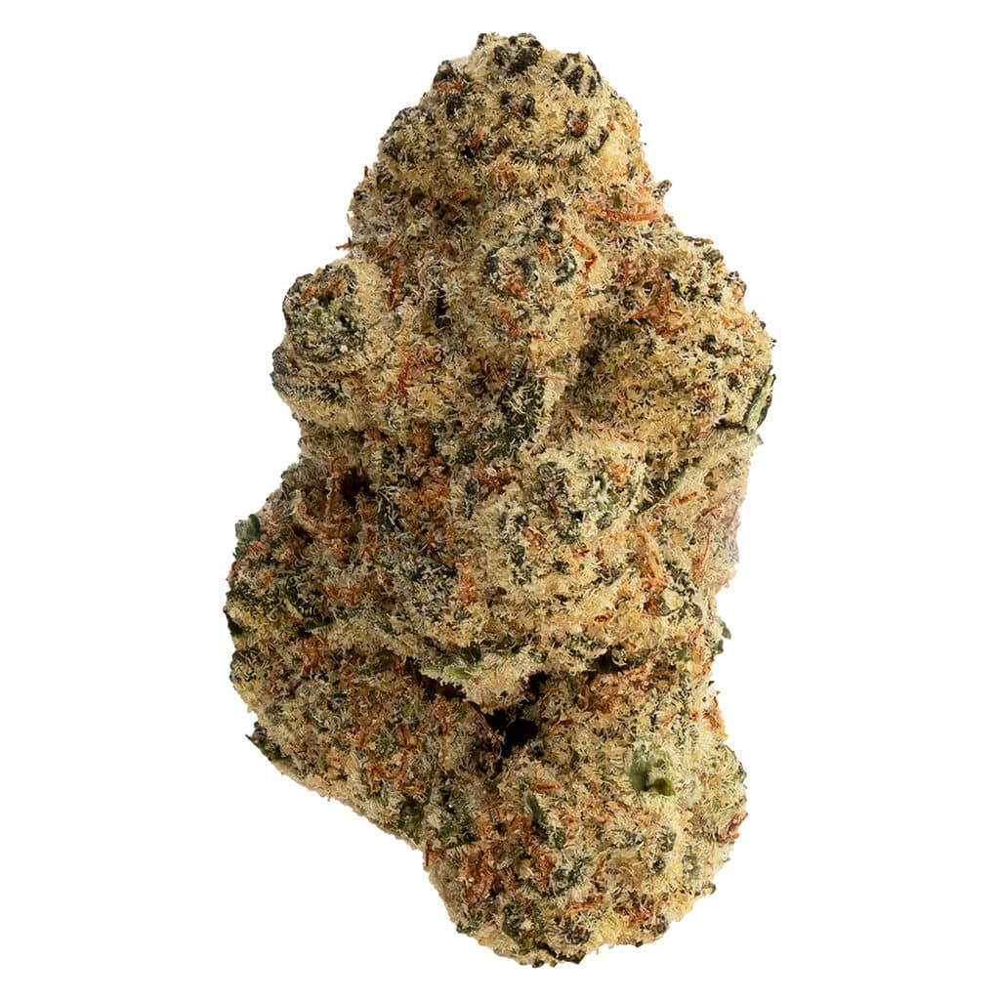
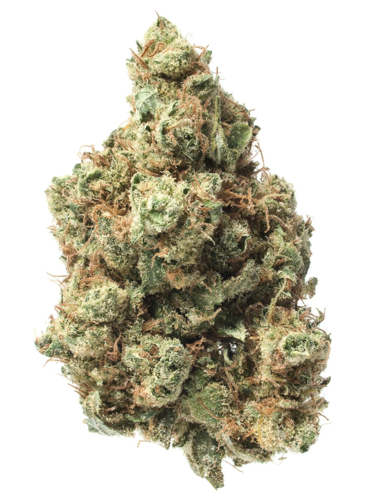

<!DOCTYPE html>
<html lang="en">
<head>
    <meta charset="UTF-8">
    <meta name="viewport" content="width=device-width, initial-scale=1.0">
    <title>Cannabis Strain Guide | Educational Resource</title>
    
</head>
<body>
    

        <!-- Hero/Intro Section -->
        

            <h1>🥦 Cannabis Strain Guide</h1>
            

                Welcome to your comprehensive guide to understanding different cannabis strains. Each variety offers unique characteristics, flavors, and therapeutic properties. This guide provides science-backed information to help you make understand the different types of strains. Learn about the distinct qualities of five notable strains below.
            

            

                This information is for educational purposes only.
            

        

        <!-- Lemon Haze -->
        

            

                

                    
                

                <h2>Lemon Haze</h2>
                Sativa-Dominant Hybrid (70/30)
            

            
            

                

                    THC Content: 17-25% | CBD: <1%
                

                

                    

                        <h3>Genetics & Background</h3>
                        
Created by crossing Lemon Skunk with Silver Haze, Lemon Haze won back-to-back High Times Cannabis Cups in 2008 and 2009. This award-winning strain has become a modern classic known for its energizing effects and citrus profile.

                    

                    

                        <h3>Primary Effects</h3>
                        <ul>
                            <li>Energizing and uplifting mental clarity</li>
                            <li>Enhanced creativity and focus</li>
                            <li>Euphoric mood elevation</li>
                            <li>Increased sociability</li>
                            <li>Mild body relaxation without sedation</li>
                        </ul>
                    

                    

                        <h3>Flavor & Aroma</h3>
                        
Intense lemon and citrus notes dominate, reminiscent of freshly peeled lemon slices. Sweet undertones with hints of hash, earthy depth, and a citrus-floral sharpness. The flavor lingers with a sweet, tangy aftertaste.

                    

                    

                        <h3>Therapeutic Benefits</h3>
                        <ul>
                            <li>Depression and chronic stress relief</li>
                            <li>Anxiety management (in moderate doses)</li>
                            <li>Fatigue and low energy</li>
                            <li>Chronic pain and migraines</li>
                            <li>Loss of appetite</li>
                        </ul>
                    

                    

                        <h3>Best Used For</h3>
                        
Daytime activities, creative projects, social gatherings, outdoor activities, and tasks requiring sustained focus and energy. Not recommended for evening use due to its stimulating effects.

                    

                    

                        <h3>Terpene Profile</h3>
                        
<strong>Limonene</strong> (citrus, mood elevation), <strong>Pinene</strong> (mental clarity, focus), <strong>Terpinolene</strong> (uplifting, anti-fatigue)

                    

                

                

                    <em>Sources: Leafly, DNA Genetics, AllBud, Sirius Cannabis</em>
                

            

        

        <!-- Bay 11 -->
        

            

                

                    
                

                <h2>Bay 11</h2>
                Sativa-Dominant
            

            
            

                

                    THC Content: 19-24% | CBD: ~1%
                

                

                    

                        <h3>Genetics & Background</h3>
                        
Winner of the 2011 High Times Cannabis Cup, Bay 11 (also known as Granddaddy Bay 11) was bred by Grand Daddy Purp. Its exact genetics remain mysterious, though it's believed to descend from Appalachia. This Bay Area favorite is renowned for its balanced effects.

                    

                    

                        <h3>Primary Effects</h3>
                        <ul>
                            <li>Clear-headed cerebral euphoria</li>
                            <li>Energizing and motivating</li>
                            <li>Enhanced focus and concentration</li>
                            <li>Uplifting mood without anxiety</li>
                            <li>Gentle body relaxation (non-sedating)</li>
                        </ul>
                    

                    

                        <h3>Flavor & Aroma</h3>
                        
Sweet and fruity with notes of mango, peach, and citrus. Earthy pine undertones complement the fruity profile. Some describe it as having a cookies-and-cream or Skittles-like sweetness with smooth, non-harsh smoke.

                    

                    

                        <h3>Therapeutic Benefits</h3>
                        <ul>
                            <li>Gastrointestinal pain and inflammation</li>
                            <li>Depression and mood disorders</li>
                            <li>Chronic stress and anxiety</li>
                            <li>ADD/ADHD (improved focus)</li>
                            <li>Appetite stimulation</li>
                            <li>Arthritis and chronic pain</li>
                        </ul>
                    

                    

                        <h3>Best Used For</h3>
                        
Daytime productivity, creative work, social activities, physical tasks, and situations requiring sustained mental clarity. Many users report it helps with completing chores and staying motivated throughout the day.

                    

                    

                        <h3>Terpene Profile</h3>
                        
<strong>Limonene</strong> (citrus, mood boost), <strong>Caryophyllene</strong> (stress relief), <strong>Myrcene</strong> (relaxation), <strong>Ocimene</strong>, <strong>Humulene</strong>, <strong>Linalool</strong>

                    

                

                

                    <em>Sources: Leafly, AllBud, I Love Growing Marijuana, Wikileaf</em>
                

            

        

        <!-- Wedding Cake -->
        

            

                

                    
                

                <h2>Wedding Cake</h2>
                Indica-Dominant Hybrid (60/40)
            

            
            

                

                    THC Content: 22-27% | CBD: <1%
                

                

                    

                        <h3>Genetics & Background</h3>
                        
Also known as Pink Cookies or Triangle Mints #23, Wedding Cake was created by Seed Junky Genetics by crossing Triangle Kush with Animal Mints. Named Leafly Strain of the Year in 2019, it's celebrated for its dessert-like flavor and potent effects.

                    

                    

                        <h3>Primary Effects</h3>
                        <ul>
                            <li>Deep physical relaxation</li>
                            <li>Euphoric mental state</li>
                            <li>Calming and stress-relieving</li>
                            <li>Initial sativa-like awareness</li>
                            <li>Pleasant body warmth and heaviness</li>
                            <li>Appetite stimulation</li>
                        </ul>
                    

                    

                        <h3>Flavor & Aroma</h3>
                        
Sweet vanilla cake batter with creamy, sugary notes. Earthy pepper undertones with hints of spice and tangy citrus. Some detect caramel, mint, and nutty flavors. The aroma is rich with floral, herbal, and dank qualities.

                    

                    

                        <h3>Therapeutic Benefits</h3>
                        <ul>
                            <li>Chronic pain and muscle spasms</li>
                            <li>Insomnia and sleep disorders</li>
                            <li>Anxiety and stress (calming effect)</li>
                            <li>Depression and mood disorders</li>
                            <li>Loss of appetite</li>
                            <li>Fibromyalgia and MS symptoms</li>
                        </ul>
                    

                    

                        <h3>Best Used For</h3>
                        
Evening relaxation, nighttime use, unwinding after work, or as a "nightcap." Great for movie nights, relaxation sessions, or preparing for sleep. May provide initial energy before settling into relaxation.

                    

                    

                        <h3>Terpene Profile</h3>
                        
<strong>Beta-Caryophyllene</strong> (anti-inflammatory, pain relief), <strong>Limonene</strong> (anxiety/depression relief), <strong>Myrcene</strong> (sedation, relaxation)

                    

                

                

                    <em>Sources: Leafly, Pacific Stone, Cannaconnection, Sativa University</em>
                

            

        

        <!-- Mary Jane -->
        

            

                

                    
                

                <h2>Mary Jane</h2>
                Balanced Hybrid / Sativa-Leaning
            

            
            

                

                    THC Content: 18-26% | CBD: <0.5%
                

                

                    

                        <h3>Genetics & Background</h3>
                        
Mary Jane is both a classic nickname for cannabis and a distinct cultivar with approachable, balanced effects. As a strain, it's presented as a versatile hybrid with bright citrus-pine aromas, fitting mainstream modern flower profiles.

                    

                    

                        <h3>Primary Effects</h3>
                        <ul>
                            <li>Uplifting cerebral rush</li>
                            <li>Happy, euphoric mental state</li>
                            <li>Balanced mind-body relaxation</li>
                            <li>Enhanced focus and creativity</li>
                            <li>Mood elevation without excessive energy</li>
                            <li>Slight sedation (for some users)</li>
                        </ul>
                    

                    

                        <h3>Flavor & Aroma</h3>
                        
Classic earthy and woody flavors with hints of pine, spice, and citrus-herbal notes. Some phenotypes lean toward sweet fruity tones while others emphasize traditional hash-like profiles. The taste varies by cultivation.

                    

                    

                        <h3>Therapeutic Benefits</h3>
                        <ul>
                            <li>Mood swings and irritability</li>
                            <li>Depression and chronic stress</li>
                            <li>Chronic pain relief</li>
                            <li>Attention deficit disorders</li>
                            <li>Anxiety (low to moderate doses)</li>
                        </ul>
                    

                    

                        <h3>Best Used For</h3>
                        
Versatile strain suitable for both daytime and evening use depending on dosage. Good for creative pursuits, social settings, or quiet relaxation. Balanced effects make it approachable for various activities.

                    

                    

                        <h3>Terpene Profile</h3>
                        
Varies by phenotype: <strong>Terpinolene</strong> (bright, cerebral) or <strong>Myrcene/Caryophyllene</strong> (relaxing, earthy). Check lab results for specific terpene dominance.

                    

                

                

                    <em>Sources: AllBud, JointCommerce Strain Database</em>
                

            

        

        <!-- Maui Wowie -->
        

            

                

                    
                

                <h2>Maui Wowie</h2>
                Sativa-Dominant (80/20)
            

            
            

                

                    THC Content: 19-28% | CBD: <1%
                

                

                    

                        <h3>Genetics & Background</h3>
                        
A legendary landrace-derived sativa originating from Hawaii in the 1960s. Grown in Maui's volcanic soil, Maui Wowie (also spelled Maui Waui) was one of the first high-THC strains. It gained fame in the counterculture era and remains a benchmark for tropical sativas.

                    

                    

                        <h3>Primary Effects</h3>
                        <ul>
                            <li>Energetic and euphoric mental lift</li>
                            <li>Enhanced creativity and motivation</li>
                            <li>Clear-headed, focused high</li>
                            <li>Uplifting without anxiety</li>
                            <li>Light body buzz (non-sedating)</li>
                            <li>Increased appetite</li>
                        </ul>
                    

                    

                        <h3>Flavor & Aroma</h3>
                        
Tropical pineapple dominates with sweet citrus, pine, and hints of lavender. Fresh, fruity notes evoke a Hawaiian paradise. Smooth smoke with a lingering sweet aftertaste that's described as refreshing and light.

                    

                    

                        <h3>Therapeutic Benefits</h3>
                        <ul>
                            <li>Depression and mood elevation</li>
                            <li>Stress and anxiety relief (low doses)</li>
                            <li>Chronic fatigue and low energy</li>
                            <li>PTSD and trauma symptoms</li>
                            <li>Mild pain and headaches</li>
                            <li>Loss of appetite</li>
                        </ul>
                    

                    

                        <h3>Best Used For</h3>
                        
Daytime activities, outdoor adventures, creative work, social gatherings, physical exercise, and situations requiring mental clarity. Perfect "wake and bake" strain for starting the day with positivity and energy.

                    

                    

                        <h3>Terpene Profile</h3>
                        
<strong>Myrcene</strong> (relaxing, earthy), <strong>Limonene</strong> (citrus, mood boost), <strong>Pinene</strong> (alertness, focus), <strong>Caryophyllene</strong> (anti-inflammatory)

                    

                

                

                    <em>Sources: Leafly, Vivosun, Body&Mind Dispensaries, Sativa University</em>
                

            

        

        <!-- Footer -->
        <footer>
            

                <strong>Important Notice:</strong> This website provides educational information about cannabis strains. This website does not promote use of Marijuana as a recreational or medicinal use, with respect to Republic Act No. 9165.
            

        </footer>
    

</body>
</html>
 
